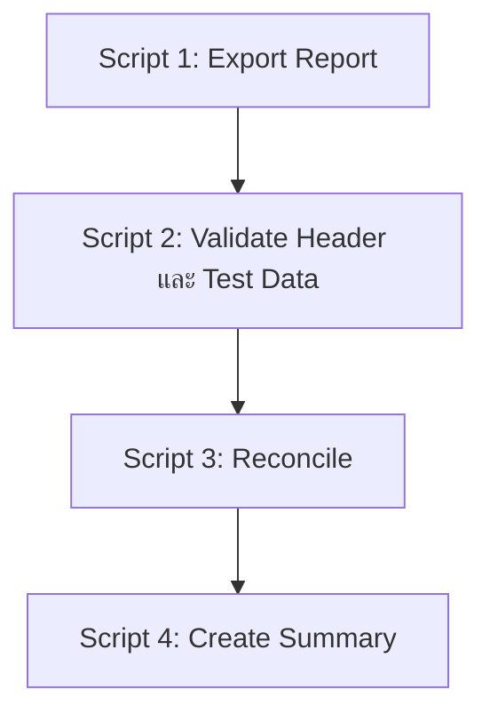

# AF1 BOT — คู่มือใช้งานสำหรับผู้เริ่มต้น

โปรเจกต์นี้ใช้ Automation ช่วยทำงานกับ AF1 Report ตั้งแต่ดาวน์โหลด Report จากระบบ UAT ตรวจสอบ Header ตรวจสอบ Test Data เปรียบเทียบข้อมูล และสร้างไฟล์สรุปผลเป็น Excel

README นี้เขียนสำหรับคนที่ยังไม่เคยใช้โปรเจกต์มาก่อน สามารถทำตามจากบนลงล่างได้ทีละขั้น

> ข้อมูลของโปรเจกต์นี้อาจมี URL, Username, Password, Test Data และข้อมูลจาก Report จริง ห้ามนำไฟล์เหล่านี้ออกไปเผยแพร่หรือ Commit ขึ้น Git

## สิ่งที่ระบบทำให้

ระบบแบ่งการทำงานออกเป็น 4 Script

| Script | หน้าที่ | ผลลัพธ์หลัก |
|---|---|---|
| Script 1 | Login และ Export Report จากระบบ UAT | Raw Report ใน `test_data/AF1_Report/<REPORT>` |
| Script 2 | ตรวจ Header ของ Report และตรวจ Header/Field ของ Test Data | Checked Report และ Checked Test Data |
| Script 3 | เปรียบเทียบ Report กับ Test Data | Reconcile Result |
| Script 4 | รวมผลทั้งหมดลง Template | Automation Summary |



ควรรันตามลำดับ `Script 1 → Script 2 → Script 3 → Script 4` เสมอ เพราะแต่ละ Script ใช้ไฟล์ผลลัพธ์จาก Script ก่อนหน้า

## Report ที่ระบบรองรับ

| Report | ประเภท | ช่วงวันที่ Export ปัจจุบัน |
|---|---|---|
| `DS_LTX` | Downstream | 25/11/2025 ถึง 27/11/2025 |
| `DS_PTX` | Downstream | 25/11/2025 ถึง 27/11/2025 |
| `DS_FTX` | Downstream | 25/11/2025 ถึง 27/11/2025 |
| `DS_FTU` | Downstream | 25/11/2025 ถึง 27/11/2025 |
| `DF_FXU` | Data File | 25/11/2025 ถึง 27/11/2025 |
| `DF_OLB` | Data File | 25/11/2025 ถึง 27/11/2025 |
| `DF_FXM` | Data File | 26/02/2026 ถึง 27/02/2026 |

ช่วงวันที่กำหนดอยู่ในไฟล์:

```text
resources/AF1-resources/setting/uat/setting.ts
```

## สิ่งที่ต้องมีในเครื่องก่อนเริ่ม

ติดตั้งโปรแกรมต่อไปนี้ก่อน

1. Node.js รุ่น LTS แนะนำ Node.js 20 หรือ 22
2. Git
3. Visual Studio Code
4. Microsoft Excel สำหรับเปิดผลลัพธ์
5. สิทธิ์เข้าใช้งาน AF1 UAT
6. สิทธิ์เข้าถึง Network Share ที่เก็บ Test Data

ตรวจว่า Node.js, npm และ Git ใช้งานได้ด้วย PowerShell:

```powershell
node --version
npm --version
git --version
```

ถ้าทั้งสามคำสั่งแสดงหมายเลข Version แปลว่าพร้อมใช้งาน

## การเตรียมโปรเจกต์ครั้งแรก

### 1. เปิด PowerShell ใน Folder โปรเจกต์

ตัวอย่าง:

```powershell
cd "C:\Path\To\AF1_BOT"
```

ตรวจว่ามาถูก Folder:

```powershell
Get-ChildItem
```

ควรเห็นไฟล์ เช่น:

```text
package.json
package-lock.json
tsconfig.json
resources
tests
test_data
```

### 2. ติดตั้ง Dependency

```powershell
npm ci
```

`npm ci` จะติดตั้ง Library ตาม `package-lock.json` เพื่อให้ทุกเครื่องใช้ Version เดียวกัน

ถ้าเป็นเครื่องใหม่และยังไม่มี Chromium ของ Playwright ให้รัน:

```powershell
npx playwright install chromium
```

Script 1 เปิด Browser แบบเห็นหน้าจอจริง จึงไม่ควรปิด Browser เองระหว่างทำงาน

### 3. สร้างไฟล์ `.env`

คัดลอกจาก `.env.example`:

```powershell
Copy-Item .env.example .env
```

เปิด `.env` แล้วกรอกค่าจริง:

```dotenv
AF1_UAT_URL=https://<UAT-URL>
AF1_UAT_USERNAME=<USERNAME>
AF1_UAT_PASSWORD=<PASSWORD>
AF1_SHAREPATH=\\<SERVER>\<SHARE>
```

ความหมายของแต่ละค่า:

| ตัวแปร | ใช้ทำอะไร |
|---|---|
| `AF1_UAT_URL` | URL สำหรับเปิดระบบ AF1 UAT |
| `AF1_UAT_USERNAME` | Username สำหรับ Login |
| `AF1_UAT_PASSWORD` | Password สำหรับ Login |
| `AF1_SHAREPATH` | Root ของ Network Share ที่เก็บ Test Data |

ข้อควรระวัง:

- ห้ามใส่เครื่องหมาย `<` และ `>` ในค่าจริง
- ห้าม Commit `.env`
- ไม่ต้องแก้ URL, Username หรือ Password ใน `setting.ts`
- ถ้าเปลี่ยน Environment ให้เปลี่ยนที่ `.env`

## การเตรียม Test Data บน Network Share

ระบบค้นหา Test Data ตามโครงสร้างนี้:

```text
AF1_SHAREPATH/
└── af1_test_data/
    ├── DS_LTX/
    ├── DS_PTX/
    ├── DS_FTX/
    ├── DS_FTU/
    ├── DF_FXU/
    ├── DF_OLB/
    └── DF_FXM/
```

ตัวอย่าง ถ้ารัน:

```powershell
npm run test:script2 -- report=DF_FXM
```

ระบบจะค้นหาไฟล์ใน:

```text
AF1_SHAREPATH/af1_test_data/DF_FXM
```

กฎสำคัญ:

- แต่ละ Folder Report ควรมีไฟล์ Excel ที่ต้องการใช้เพียง 1 ไฟล์
- ปิดไฟล์ Excel ก่อนรัน เพื่อไม่ให้มีไฟล์ชั่วคราวชื่อขึ้นต้นด้วย `~$`
- ชื่อไฟล์ Test Data เป็นชื่ออะไรก็ได้ เพราะระบบค้นหาจาก Folder Report
- ตรวจว่าเครื่องสามารถเปิด Network Share ได้ก่อนรัน

## การเตรียม Summary Template

Template ถูกเก็บไว้ที่:

```text
test_data/template
```

ต้องมีไฟล์ครบ 7 ไฟล์ และชื่อไฟล์ต้องตรงทุกตัวอักษร:

```text
DF_FXM_Automation_Summary.xlsx
DF_FXU_Automation_Summary.xlsx
DF_OLB_Automation_Summary.xlsx
DS_FTU_Automation_Summary.xlsx
DS_FTX_Automation_Summary.xlsx
DS_LTX_Automation_Summary.xlsx
DS_PTX_Automation_Summary.xlsx
```

ห้ามมี `(1)` หรือ `(2)` ต่อท้ายชื่อ เช่น:

```text
DF_FXM_Automation_Summary(2).xlsx
```

เพราะ Code จะหาไฟล์ชื่อ `DF_FXM_Automation_Summary.xlsx` เท่านั้น

ตรวจไฟล์ทั้งหมดด้วย PowerShell:

```powershell
Get-ChildItem .\test_data\template\*.xlsx |
  Select-Object Name, LastWriteTime
```

ชื่อ Worksheet แรกของแต่ละ Template ต้องเป็น:

| Report | ชื่อ Worksheet Summary |
|---|---|
| `DS_PTX` | `DS_PTX Summary Test Results` |
| `DS_FTX` | `DS_FTX Summary Test Results` |
| `DS_LTX` | `DS_LTX_Summary Result` |
| `DS_FTU` | `DS_FTU_Summary Result` |
| `DF_FXU` | `DF_FXU_Summary Result` |
| `DF_OLB` | `DF_OLB_Summary Result` |
| `DF_FXM` | `DF_FXM_Summary Result` |

Template ใหม่ใช้ตำแหน่งข้อมูลด้านบนดังนี้:

| Cell | ข้อมูล |
|---|---|
| `C4` | Report File Name |
| `C5` | Execution Date |
| `C6` | Actual Execution Time Start |
| `C7` | Actual Execution Time End |
| `C8` | Duration Time |
| `C9` | Run ID |
| `C10` | Verified By |

ชีท Summary Result ถูกตั้งให้ซ่อน Gridlines ส่วนชีท Reconcile, Report และ Test Data ยังแสดง Gridlines ตามปกติ

## วิธีรันแบบง่ายที่สุด

ถ้าต้องการรัน Script 1–4 ให้ครบสำหรับ Report เดียว ใช้:

```powershell
npm run test -- report=DS_FTX
```

เปลี่ยน `DS_FTX` เป็น Report ที่ต้องการ เช่น:

```powershell
npm run test -- report=DF_FXM
```

คำสั่งนี้จะรันไฟล์ Test ทั้งหมดตามชุดของโปรเจกต์

## วิธีรันทีละ Script

วิธีนี้เหมาะสำหรับตรวจสอบทีละขั้น หรือแก้ Error แล้วต้องการลองใหม่เฉพาะขั้นตอน

ตัวอย่าง `DS_FTX`:

```powershell
npm run test:script1 -- report=DS_FTX
npm run test:script2 -- report=DS_FTX
npm run test:script3 -- report=DS_FTX
npm run test:script4 -- report=DS_FTX
```

ต้องรันตามลำดับ ห้ามเริ่มจาก Script 4 หากยังไม่มีผลลัพธ์จาก Script ก่อนหน้า

### รันหลาย Report

คั่นชื่อ Report ด้วย comma และไม่จำเป็นต้องเว้นวรรค:

```powershell
npm run test:script1 -- report=DS_LTX,DS_PTX,DS_FTX,DS_FTU,DF_FXU,DF_OLB,DF_FXM
npm run test:script2 -- report=DS_LTX,DS_PTX,DS_FTX,DS_FTU,DF_FXU,DF_OLB,DF_FXM
npm run test:script3 -- report=DS_LTX,DS_PTX,DS_FTX,DS_FTU,DF_FXU,DF_OLB,DF_FXM
npm run test:script4 -- report=DS_LTX,DS_PTX,DS_FTX,DS_FTU,DF_FXU,DF_OLB,DF_FXM
```

ระบบจะแปลงชื่อเป็นตัวพิมพ์ใหญ่ ตัดช่องว่าง และตัดชื่อที่ซ้ำกันให้อัตโนมัติ

ตัวอย่างนี้จึงใช้ได้:

```powershell
npm run test:script3 -- report=df_fxu,df_fxm,DF_FXM
```

ระบบจะรันเพียง:

```text
DF_FXU
DF_FXM
```

## Script 1 — Login และ Export Report

คำสั่ง:

```powershell
npm run test:script1 -- report=<REPORT>
```

ตัวอย่าง:

```powershell
npm run test:script1 -- report=DF_FXM
```

สิ่งที่ Script 1 ทำ:

1. อ่าน URL, Username และ Password จาก `.env`
2. เปิด Chromium แบบเห็น Browser
3. Login เข้า AF1 UAT
4. เลือก Report ตามค่า `report=`
5. กรอกช่วงวันที่
6. Export และรอ Download
7. บันทึก Raw Report
8. เริ่มจับเวลารอบใหม่ของ Report

ผลลัพธ์อยู่ที่:

```text
test_data/AF1_Report/<REPORT>
```

ตัวอย่าง:

```text
test_data/AF1_Report/DF_FXM/EXPORT_DF_FXM_20260226-20260227_<TIMESTAMP>.xlsx
```

เมื่อรัน Script 1 ซ้ำ ระบบจับเวลาจะเริ่มรอบใหม่สำหรับ Report นั้น

## Script 2 — ตรวจ Report Header และ Test Data

คำสั่ง:

```powershell
npm run test:script2 -- report=<REPORT>
```

สิ่งที่ Script 2 ทำ:

1. หา Raw Report ล่าสุดของ Report ที่เลือก
2. ตรวจว่า Report มี Header ที่จำเป็นครบหรือไม่
3. คัดลอก Report ไปยัง Checked Report
4. อ่าน Test Data ต้นฉบับจาก Network Share
5. ตรวจ Header ของ Test Data
6. ตรวจ Field ที่จำเป็น
7. สร้างไฟล์ผลตรวจ Test Data

ผลลัพธ์อยู่ที่:

```text
Test_result/Checked-report-header/<REPORT>
Test_result/Checked-testdata-header/<REPORT>
```

ข้อความตัวอย่าง:

```text
🟢 FOUND
```

หมายถึงพบ Header

```text
🔴 EMPTY FIELD
```

หมายถึงพบช่องว่างใน Field ที่ต้องตรวจ ควรเปิดไฟล์ผลลัพธ์ดู Row และ Header ที่แจ้ง

ข้อสำคัญ: Mocha อาจแสดงว่า Test ทำงานสำเร็จ แม้ Business Validation จะพบช่องว่าง เพราะระบบสามารถสร้างไฟล์ผลตรวจได้สำเร็จ ต้องอ่านหัวข้อ `Field Validation` และเปิด Excel ผลลัพธ์ประกอบด้วย

## Script 3 — Reconcile Report กับ Test Data

คำสั่ง:

```powershell
npm run test:script3 -- report=<REPORT>
```

สิ่งที่ Script 3 ทำ:

1. อ่าน Checked Report ล่าสุดจาก Script 2
2. อ่าน Test Data ต้นฉบับจาก Network Share
3. ใช้ Matching Logic ของ Report นั้น
4. เปรียบเทียบ Field ตาม Mapping และ Rule
5. สร้าง Reconcile Result

ผลลัพธ์อยู่ที่:

```text
Test_result/Reconcile-report/<REPORT>
```

ตัวอย่าง:

```text
Test_result/Reconcile-report/DF_FXM/DF_FXM_Reconcile_<TIMESTAMP>.xlsx
```

คำที่พบใน Log:

| ข้อความ | ความหมาย |
|---|---|
| `EXACT` | พบแถวที่ตรงตาม Matching Key หลัก |
| `NOT_FOUND` | ไม่พบรายการใน Report |
| `FALLBACK_UNAVAILABLE` | ไม่สามารถใช้ Fallback Matching ได้ |
| `PASS` | ผล Business Validation ผ่าน |
| `FAIL` | ผล Business Validationไม่ผ่าน |

ข้อสำคัญ: ข้อความ `1 passing` ของ Mocha หมายถึง Script รันจนจบ ไม่ได้หมายความว่าทุก Test Case ใน Reconcile เป็น PASS ต้องดูจำนวน `PASS`, `FAIL` และเปิดไฟล์ Excel

## Script 4 — สร้าง Automation Summary

คำสั่ง:

```powershell
npm run test:script4 -- report=<REPORT>
```

สิ่งที่ Script 4 ใช้:

- Reconcile Result จาก Script 3
- Checked Report จาก Script 2
- Checked Test Data จาก Script 2
- Original Test Data จาก Network Share
- Template จาก `test_data/template`
- Timing State ของ Script 1–3

สิ่งที่ Script 4 ทำ:

1. เลือก Template ให้ตรงกับ Report
2. เขียนข้อมูล Summary ลง `C4:C10`
3. เขียน Total Checked, Passed และ Failed
4. เติมรายละเอียดผลการตรวจ
5. คัดลอก Reconcile Worksheet
6. คัดลอก Checked Report Worksheet
7. คัดลอก Test Data Worksheet
8. ซ่อน Gridlines เฉพาะ Summary Result
9. บันทึกเวลาของ Script 4
10. สร้างไฟล์ Final Summary

ผลลัพธ์อยู่ที่:

```text
Test_result/Summary-report/<REPORT>
```

ไฟล์ Summary ประกอบด้วย 4 Worksheet:

1. Summary Result
2. `<REPORT>_Reconcile`
3. `<REPORT>`
4. `Test Data`

ค่า `Report File Name` ใน Summary แสดงรูปแบบ:

```text
<REPORT>_Summary_Test_Result_<TIMESTAMP>
```

ตัวอย่าง:

```text
DS_FTX_Summary_Test_Result_20260818_144647
```

## ระบบจับเวลารวม Script 1–4

แต่ละ Script รันเป็น Node.js Process แยกกัน ตัวแปรใน Memory จึงหายเมื่อคำสั่งจบ ระบบต้องเก็บ Timing State เป็น JSON เพื่อส่งเวลาระหว่าง Script

ไฟล์ JSON อยู่ที่:

```text
resources/AF1-resources/utils/summary/Automation-run-time/<REPORT>.json
```

ตัวอย่าง:

```text
resources/AF1-resources/utils/summary/Automation-run-time/DS_FTX.json
```

Timing State เก็บเวลาของขั้นตอน:

```text
SCRIPT_1_EXPORT
SCRIPT_2_REPORT_HEADER
SCRIPT_2_TEST_DATA
SCRIPT_3_COMPARE
SCRIPT_4_SUMMARY
```

การคำนวณ `Duration Time`:

- รวมเฉพาะเวลาที่แต่ละ Script ทำงานกับ Report นั้นจริง
- ไม่รวมเวลาที่ผู้ใช้หยุดระหว่างคำสั่ง
- ไม่รวมเวลาที่ระบบกำลังทำ Report อื่น
- ถ้ารัน Stage เดิมซ้ำ ระบบใช้เวลารอบล่าสุดแทน ไม่บวกเวลาซ้ำ

Folder `Automation-run-time` เป็นข้อมูลชั่วคราวและต้องถูก Ignore ใน Git

ถ้าลบ JSON ก่อนรัน Script 4 ระบบจะไม่ทราบเวลาของ Script ก่อนหน้า ให้เริ่มใหม่จาก Script 1

## ตำแหน่งไฟล์ผลลัพธ์ทั้งหมด

```text
AF1_BOT/
├── test_data/
│   ├── AF1_Report/
│   │   └── <REPORT>/
│   └── template/
│       └── <REPORT>_Automation_Summary.xlsx
├── Test_result/
│   ├── Checked-report-header/
│   │   └── <REPORT>/
│   ├── Checked-testdata-header/
│   │   └── <REPORT>/
│   ├── Reconcile-report/
│   │   └── <REPORT>/
│   └── Summary-report/
│       └── <REPORT>/
└── resources/
    └── AF1-resources/
        └── utils/
            └── summary/
                └── Automation-run-time/
                    └── <REPORT>.json
```

## วิธีตรวจว่าผลลัพธ์สำเร็จจริง

หลังรันครบ ให้ตรวจตามรายการนี้

### Script 1

- Terminal แสดง `Download Success`
- มีไฟล์ Excel ใหม่ใน `test_data/AF1_Report/<REPORT>`
- จำนวน Report Rows ไม่เป็น Error

### Script 2

- Header ที่จำเป็นแสดง `FOUND`
- เปิด Checked Test Data ดูช่องที่เป็นสีหรือข้อความแจ้งเตือน
- ตรวจ `Field Validation Passed/Failed`

### Script 3

- มี Reconcile Result ใหม่
- ตรวจจำนวน Test Case
- ตรวจจำนวน PASS และ FAIL
- เปิด Excel ดู Reason และ Remark

### Script 4

- มี Summary ใหม่
- `C4:C10` มีข้อมูลครบ
- Total Checked เท่ากับจำนวนที่ต้องการ
- Passed + Failed สอดคล้องกับ Reconcile
- สูตร Percentage แสดงผลถูกต้อง
- Summary Result ไม่มี Gridlines
- Reconcile, Report และ Test Data ยังมี Gridlines

## Error ที่พบบ่อยและวิธีแก้

### 1. Missing required environment variable

ตัวอย่าง:

```text
Missing required environment variable: AF1_UAT_URL
```

สาเหตุ: ไม่มี `.env` หรือค่าด้านในว่าง

วิธีแก้:

1. ตรวจว่ามีไฟล์ `.env` ที่ Root โปรเจกต์
2. ตรวจ `AF1_UAT_URL`, `AF1_UAT_USERNAME`, `AF1_UAT_PASSWORD` และ `AF1_SHAREPATH`
3. ปิดและเปิด Terminal ใหม่ถ้าจำเป็น

### 2. กรุณากรอกชื่อรายงานที่ท่านต้องการ

สาเหตุ: ไม่ได้ใส่ `report=`

ผิด:

```powershell
npm run test:script1
```

ถูก:

```powershell
npm run test:script1 -- report=DS_FTX
```

### 3. ไม่รองรับ Report

ตัวอย่าง:

```text
ไม่รองรับ Report: DS_ABC
```

ใช้ชื่อจากรายการที่รองรับเท่านั้น และตรวจ `_` ให้ถูกตำแหน่ง

### 4. No Excel files found in folder

ตัวอย่าง:

```text
No Excel files found in folder: test_data\AF1_Report\DF_OLB
```

สาเหตุ: ยังไม่มี Raw Report ของ Report นั้น

วิธีแก้:

```powershell
npm run test:script1 -- report=DF_OLB
```

แล้วจึงรัน Script 2

### 5. Summary template not found

ตัวอย่าง:

```text
Summary template not found: ...\test_data\template\DF_FXM_Automation_Summary.xlsx
```

ตรวจ:

```powershell
Test-Path ".\test_data\template\DF_FXM_Automation_Summary.xlsx"
```

ต้องได้:

```text
True
```

ถ้าได้ `False` ให้ตรวจว่า:

- วางไฟล์ไว้ผิด Folder หรือไม่
- ชื่อไฟล์มี `(1)` หรือ `(2)` หรือไม่
- นามสกุลเป็น `.xlsx` หรือไม่
- ชื่อ Report เป็น `DF_FXM` ถูกต้องหรือไม่

### 6. Worksheet not found in template

สาเหตุ: ชื่อ Worksheet ภายใน Template ไม่ตรงกับ Config

วิธีแก้: เปรียบเทียบกับตารางชื่อ Worksheet ในหัวข้อ Summary Template ห้ามเพิ่มช่องว่างหรือเปลี่ยน `_` เอง

### 7. Automation timing state not found

สาเหตุ:

- ยังไม่ได้รัน Script 1
- JSON ถูกลบ
- ย้าย Path ของ Timing State แล้วไม่ได้เริ่ม Run ใหม่

วิธีแก้: รันใหม่ตั้งแต่ Script 1 สำหรับ Report นั้น

### 8. `npx tsc --noEmit` ไม่มีข้อความ

นี่คือผลลัพธ์ที่ถูกต้อง หมายถึง TypeScript ไม่พบ Compile Error

### 9. `git diff --check` แจ้ง trailing whitespace

ตัวอย่าง:

```text
trailing whitespace
```

สาเหตุ: มีช่องว่างท้ายบรรทัด ให้ลบช่องว่างแล้วบันทึกไฟล์ จากนั้นรันใหม่

### 10. LF will be replaced by CRLF

ตัวอย่าง:

```text
LF will be replaced by CRLF the next time Git touches it
```

เป็น Warning เรื่องรูปแบบขึ้นบรรทัดบน Windows ไม่ใช่ Compile Error และไม่กระทบ Logic ของโปรแกรม

## การตรวจ Code ก่อน Commit

ทุกครั้งหลังแก้ Code ให้รัน:

```powershell
npx tsc --noEmit
git diff --check
git status --short
```

ความหมาย:

| คำสั่ง | ใช้ตรวจอะไร |
|---|---|
| `npx tsc --noEmit` | ตรวจ TypeScript โดยไม่สร้างไฟล์ JavaScript |
| `git diff --check` | ตรวจช่องว่างท้ายบรรทัดและปัญหา Diff |
| `git status --short` | ดูไฟล์ที่แก้ เพิ่ม ลบ หรือยังไม่ได้ Stage |

ก่อน Commit ให้ Stage:

```powershell
git add -A
```

ตรวจไฟล์ที่ Stage:

```powershell
git diff --cached --check
git diff --cached --stat
git status --short
```

ถ้าทุกอย่างถูกต้องจึง Commit:

```powershell
git commit -m "update AF1 automation"
```

อย่าใช้ `git add -A` โดยไม่ตรวจ `git status` ก่อน โดยเฉพาะเวลามี Test Data หรือไฟล์ Excel จริงอยู่ในเครื่อง

## `.gitignore` ที่ควรมี

ส่วนสำคัญควรมีรูปแบบประมาณนี้:

```gitignore
# Playwright
node_modules/
/test-results/
/playwright-report/
/blob-report/
/playwright/.cache/
/playwright/.auth/

# Environment variables
.env
.env.*
!.env.example

# Generated result
Test_result/

# Ignore test data แต่เก็บ Summary Template
/test_data/*
!/test_data/template/
!/test_data/template/*.xlsx

# Timing State ชั่วคราวของ Script 1-4
resources/AF1-resources/utils/summary/Automation-run-time/

# Local files
desktop.ini
*.zip
```

ตรวจว่า Template ไม่ถูก Ignore:

```powershell
git status --short --untracked-files=all -- test_data/template
```

ตรวจว่า Timing JSON ถูก Ignore:

```powershell
git check-ignore -v resources/AF1-resources/utils/summary/Automation-run-time/DS_FTX.json
```

## โครงสร้าง Code สำคัญ

```text
AF1_BOT/
├── Scripts/
│   └── run-selected-test.ts
├── tests/
│   ├── script1-login-export.spec.ts
│   ├── script2-validate-report-and-testdata.spec.ts
│   ├── script3-compare-report.spec.ts
│   └── script4-summary-results.spec.ts
├── resources/
│   └── AF1-resources/
│       ├── config/
│       ├── pages/
│       ├── setting/
│       └── utils/
│           ├── reconcile/
│           ├── summary/
│           │   ├── Automation-run-time/
│           │   └── automation-run-timing.ts
│           └── validators/
├── test_data/
│   ├── AF1_Report/
│   └── template/
├── Test_result/
├── .env.example
├── package.json
└── tsconfig.json
```

หน้าที่ของ Folder หลัก:

| Folder/File | หน้าที่ |
|---|---|
| `tests` | จุดเริ่มการทำงานของ Script 1–4 |
| `Scripts/run-selected-test.ts` | เปิดไฟล์ Test ที่เลือกและส่งค่า `report=` ให้ Mocha |
| `config` | รายชื่อ Report, Header Config, Mapping และ Test Data Config |
| `pages` | Locator และคำสั่งที่ใช้ควบคุมหน้าเว็บ |
| `setting/uat/setting.ts` | อ่าน `.env`, รายชื่อ Report และช่วงวันที่ Export |
| `utils/validators` | Logic ตรวจ Header และ Field |
| `utils/reconcile` | Matching, Mapping และ Reconcile แยกตาม Report |
| `utils/summary` | Logic อ่าน Template สร้าง Summary และจัดการ Timing State |
| `utils/summary/automation-run-timing.ts` | บันทึกเวลาแต่ละ Script แยกตาม Report |

## ถ้าต้องเพิ่ม Report ใหม่

อย่าเริ่มจากการ Copy ไฟล์จำนวนมากทันที ให้เตรียมข้อมูลต่อไปนี้ก่อน:

1. ชื่อ Report ที่แสดงบนหน้า UAT
2. Locator หรือข้อความที่ใช้เลือก Report
3. ช่วงวันที่ Export
4. Header ของ Raw Report
5. Header ของ Test Data
6. Matching Key
7. Mapping ระหว่าง Test Data กับ Report
8. Rule ของ PASS, FAIL, SKIP และ Expected Absence
9. Template Summary
10. ชื่อ Worksheet ภายใน Template

จากนั้นตรวจไฟล์หลัก:

```text
setting/uat/setting.ts
config/report-config.ts
config/testdata-config.ts
config/mapping-config.ts
config/report-profile-registry.ts
utils/reconcile/<REPORT>
utils/summary/automation-summary-writer.ts
tests/script1-login-export.spec.ts
tests/script2-validate-report-and-testdata.spec.ts
tests/script3-compare-report.spec.ts
tests/script4-summary-results.spec.ts
```

ควรเพิ่มทีละ Script และรัน `npx tsc --noEmit` หลังแก้แต่ละส่วน

## ข้อจำกัดและจุดที่ต้องระวัง

- Logic ของ `DF_FXU` และ `DF_FXM` ปัจจุบันรองรับสกุลเงินตาม Requirement ที่กำหนดไว้ โดยชุดที่ใช้งานปัจจุบันเน้น USD
- การเปลี่ยน Header ใน Template หรือ Test Data อาจกระทบ Mapping แม้ชื่อจะต่างกันเพียงช่องว่าง
- อย่าแก้ Rule ของ Report หนึ่งโดยสมมติว่าจะใช้กับอีก Report ได้ แม้โครงสร้างจะคล้ายกัน
- การรัน Script 3 สำเร็จไม่ได้แปลว่าทุก Business Test Case PASS
- ต้องตรวจ Excel Result และ Log ทุกครั้ง
- อย่า Commit `.env`, Raw Report, Checked Result, Reconcile Result, Summary Result หรือ Timing JSON
- Template ต้อง Commit เพื่อให้เครื่องอื่นและ Jenkins ใช้งานได้

## Checklist สำหรับผู้ใช้งานครั้งแรก

- [ ] ติดตั้ง Node.js, npm และ Git แล้ว
- [ ] รัน `npm ci` สำเร็จ
- [ ] รัน `npx playwright install chromium` แล้ว
- [ ] สร้าง `.env` และกรอกครบ 4 ค่า
- [ ] เปิด Network Share ได้
- [ ] แต่ละ Report มี Test Data เพียง 1 ไฟล์
- [ ] มี Template ครบ 7 ไฟล์ใน `test_data/template`
- [ ] ชื่อ Template ไม่มี `(1)` หรือ `(2)`
- [ ] รัน `npx tsc --noEmit` ผ่าน
- [ ] รัน Script 1–4 ตามลำดับ
- [ ] ตรวจ Excel Result ไม่ได้ดูเพียงข้อความ `passing`

## สรุปคำสั่งที่ใช้บ่อย

ติดตั้ง:

```powershell
npm ci
npx playwright install chromium
Copy-Item .env.example .env
```

รันครบ Script 1–4:

```powershell
npm run test -- report=DS_FTX
```

รันทีละ Script:

```powershell
npm run test:script1 -- report=DS_FTX
npm run test:script2 -- report=DS_FTX
npm run test:script3 -- report=DS_FTX
npm run test:script4 -- report=DS_FTX
```

ตรวจ Code:

```powershell
npx tsc --noEmit
git diff --check
git status --short
```

ตรวจไฟล์ก่อน Commit:

```powershell
git add -A
git diff --cached --check
git diff --cached --stat
git status --short
```

ถ้าเกิด Error ให้เริ่มตรวจจาก Path ใน Error ก่อนเสมอ เพราะ Error ส่วนใหญ่ของโปรเจกต์นี้เกิดจากไฟล์ไม่อยู่ใน Folder ที่ Code กำลังค้นหา หรือชื่อไฟล์/Worksheet ไม่ตรงกับ Config
